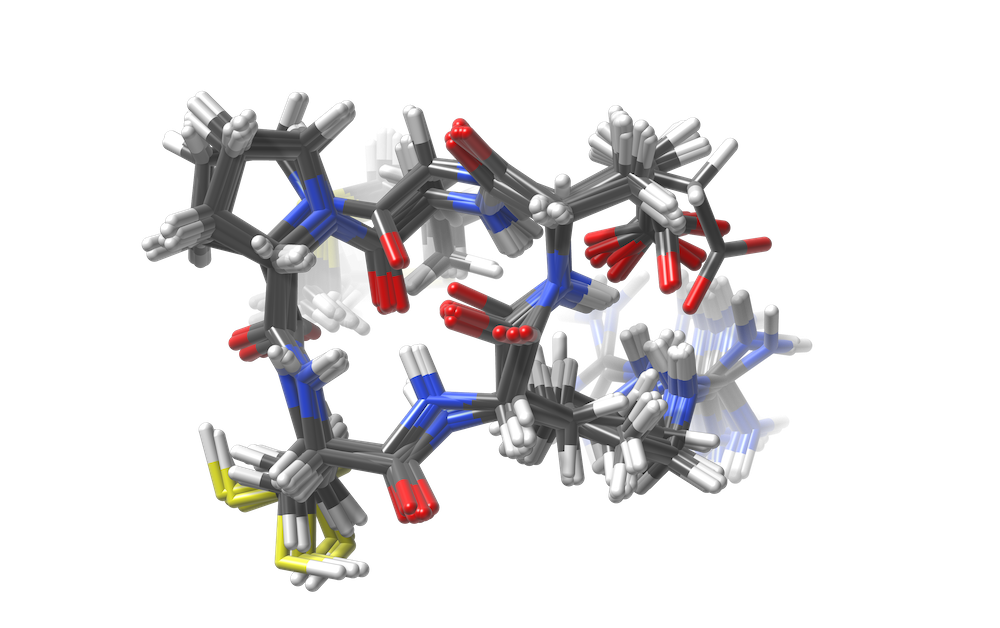

# CREMP

Generate conformer ensembles using CREST. Used to generate the [CREMP database](https://zenodo.org/doi/10.5281/zenodo.7931444) and the [CREMP-CycPeptMPDB database](https://zenodo.org/doi/10.5281/zenodo.10798261) described in [CREMP: Conformer-rotamer ensembles of macrocyclic peptides for machine learning](https://doi.org/10.1038/s41597-024-03698-y).



## Installation

```bash
conda env create -f env.yml
conda activate cremp
pip install -e .
```

To enable post-processing utilities, you need to install OpenEye and obtain a license:
```bash
conda install -c openeye openeye-toolkits
```

## Usage

Run the whole pipeline with `run_crest.py`. This embeds conformers with RDKit ETKDGv3, optimizes the low-energy ones with xTB, and subsequently runs CREST. Run `run_crest.py --help` for an overview of the options.

Alternatively, three subcommands are possible to run individual steps in the pipeline. These are

- `run_crest.py rdconf`
- `run_crest.py xtbopt`
- `run_crest.py crest`

To post-process the CREST output, use `scripts/postprocess.py`. See the instructions in the docstring of the `main` function for details about the expected file formats and directory structure.

## Downloading and using CREMP

The published CREMP dataset is available on [Zenodo](https://zenodo.org/doi/10.5281/zenodo.7931444). After downloading and extracting `pickle.tar.gz`, molecules can be loaded as follows:

```python
from cremp.utils.chem_utils import load_mol

mol_path = 'pickle/A.c.Men.S.pickle'  # Replace with the path of your choice

mol_dict = load_mol(mol_path)
mol = mol_dict['rd_mol']  # Get RDKit molecule containing conformers

print(mol.GetNumConformers())
```

## License

Licensed under the MIT License. See [LICENSE](LICENSE) for additional details.

## Citation

If using the CREMP dataset, please cite

```
@article{grambow2024cremp,
    title = {{CREMP: Conformer-rotamer ensembles of macrocyclic peptides for machine learning}},
    author = {Grambow, Colin A. and Weir, Hayley and Cunningham, Christian N. and Biancalani, Tommaso and Chuang, Kangway V.},
    year = {2024},
    journal = {Scientific Data},
    doi = {10.1038/s41597-024-03698-y},
    pages = {859},
    number = {1},
    volume = {11}
}
```
